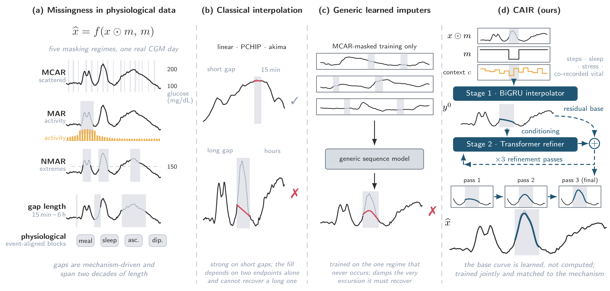
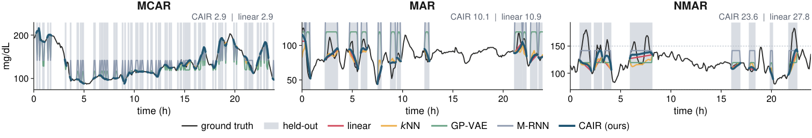

# CAIR: Curriculum-Aware Interpolate-then-Refine

**[Learned Physiological Time-Series Imputation under Realistic Missingness](https://arxiv.org/abs/2608.21207)**

Yu-Chao Huang, Haochen Zhang, Nicholas Konz, Tianlong Chen  
UNITES Lab, University of North Carolina at Chapel Hill

## Overview

CAIR learns a base curve with a bidirectional GRU and corrects it with a Transformer refiner. The model is trained with a random-gap curriculum and evaluated by missingness mechanism and gap length on AI-READI and MIMIC-III.



## Installation

Python 3.10 or later, with PyTorch 2.1 or later.

```bash
pip install -e .
```

## Data

Place prepared AI-READI CGM splits in `data/aireadi_cgm_full/`, activity channels in `data/aireadi_cgm_mm/`, and MIMIC-III splits in `data/prepared/mimic_abp/` or `data/prepared/mimic_hr/`. Place model checkpoints in `method_checkpoints/cair/`.

Data and checkpoints are not included. Data sources: [AI-READI](https://aireadi.org/) and [MIMIC-III](https://physionet.org/content/mimiciii/).

## Usage

```bash
python cair.py -p mechanisms
python cair.py -p shortgap
python cair.py -p physiological
python cair.py -p mechanisms -d mimic_abp -n 400 -c method_checkpoints/cair_mimic_abp_realistic
```

Use `-g -1` for CPU, `-r` for a prepared data directory, and `-o` for the output path. Results are written to `results/`. For M-RNN and GP-VAE, pass the PyPOTS interpreter with `-x`.

Train one ensemble member:

```bash
python cair.py -p train -s 1 -e 100
```

Training options and model configurations are in `methods/cair/train_cair.py` and `configs/cair/`.

```python
from methods.cair import CAIRImputer

model = CAIRImputer(device="cuda:0")
prediction = model.impute(series, observed_mask)
```

`series` uses training-set normalization; `observed_mask` is 1 at observed positions and 0 at missing positions.

## Results

Published results on all 352 AI-READI test participants. RMSE in mg/dL; lower is better. Bold indicates the best value; underlining indicates the second best.

### Realistic missingness (Table 1)

<table>
<tr><td>Method</td><td>MCAR↓</td><td>MAR↓</td><td>NMAR↓</td></tr>
<tr><td><strong>CAIR (Ours)</strong></td><td><strong>2.66</strong></td><td><strong>10.33</strong></td><td><strong>23.50</strong></td></tr>
<tr><td>linear interp</td><td><ins>2.91</ins></td><td><ins>12.34</ins></td><td><ins>28.94</ins></td></tr>
<tr><td>MICE</td><td>3.26</td><td>19.83</td><td>49.35</td></tr>
<tr><td>missForest</td><td>3.33</td><td>16.54</td><td>40.90</td></tr>
<tr><td>hot-deck</td><td>5.04</td><td>16.06</td><td>43.44</td></tr>
<tr><td>kNN</td><td>5.19</td><td>15.45</td><td>43.54</td></tr>
<tr><td>LOCF</td><td>6.22</td><td>19.84</td><td>34.44</td></tr>
<tr><td>Fourier</td><td>9.91</td><td>18.47</td><td>32.72</td></tr>
<tr><td>mean</td><td>28.59</td><td>28.81</td><td>54.86</td></tr>
<tr><td>GP-VAE</td><td>26.46</td><td>40.49</td><td>70.39</td></tr>
<tr><td>M-RNN</td><td>44.39</td><td>44.34</td><td>64.63</td></tr>
</table>

### Gap length (Table 2)

<table>
<tr><td>Method</td><td>15 min</td><td>30 min</td><td>45 min</td><td>60 min</td><td><strong>mean</strong>↓</td></tr>
<tr><td><strong>CAIR (Ours)</strong></td><td><ins>2.84</ins></td><td><ins>5.03</ins></td><td><strong>6.66</strong></td><td><strong>8.23</strong></td><td><strong>5.69</strong></td></tr>
<tr><td>akima</td><td><strong>2.76</strong></td><td><strong>5.01</strong></td><td><ins>6.87</ins></td><td>8.61</td><td><ins>5.81</ins></td></tr>
<tr><td>PCHIP</td><td>2.84</td><td>5.14</td><td>6.92</td><td><ins>8.58</ins></td><td>5.87</td></tr>
<tr><td>linear</td><td>3.20</td><td>5.64</td><td>7.45</td><td>9.09</td><td>6.34</td></tr>
<tr><td>SAITS</td><td>4.60</td><td>7.54</td><td>9.76</td><td>11.79</td><td>8.42</td></tr>
<tr><td>BRITS</td><td>6.25</td><td>9.42</td><td>11.67</td><td>13.33</td><td>10.17</td></tr>
</table>



The remaining tables and figures are in [paper/](paper/README.md).

## Repository structure

```text
cair.py                    Training and evaluation entry point
methods/cair/              Model, inference, and training
baselines/                 Statistical and neural baselines
cgm_datasets/              Dataset adapters and preprocessing
experiments/               Evaluation, cross-validation, and analysis
configs/                   Model and ensemble configuration
utils/                     Masks and clinical metrics
tests/                     Data-independent tests
figures/                   Published figures
paper/                     Published tables and additional figures
```

## Citation

```bibtex
@misc{huang2026cair,
      title={Curriculum-Aware Interpolate-then-Refine: Learned Physiological Time-Series Imputation under Realistic Missingness}, 
      author={Yu-Chao Huang and Haochen Zhang and Nicholas Konz and Tianlong Chen},
      year={2026},
      eprint={2608.21207},
      archivePrefix={arXiv},
      primaryClass={cs.LG},
      url={https://arxiv.org/abs/2608.21207}, 
}
```
