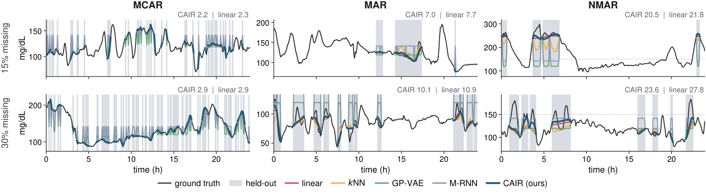
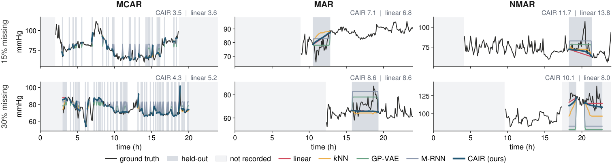
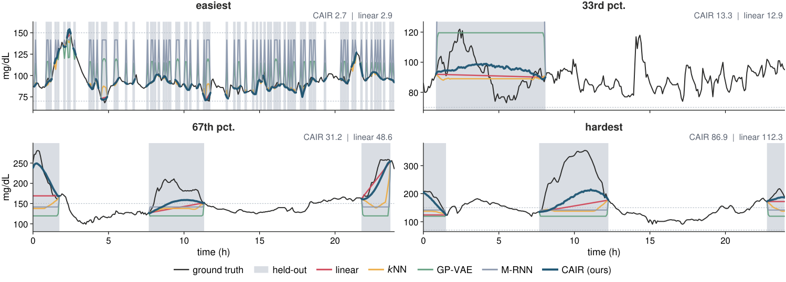

# Paper assets

Tables and figures from [Curriculum-Aware Interpolate-then-Refine](https://arxiv.org/abs/2608.21207v1), Yu-Chao Huang, Haochen Zhang, Nicholas Konz, and Tianlong Chen (2026).

[All 16 tables](tables.md). The table source is in `tables.tex`; ablation macros are in `ablation_numbers.tex`.

Figure 1 is cropped from the published PDF. Figures 2 to 5 retain the original PDF assets and PNG previews in `figures/`. Paper assets are licensed under [CC BY 4.0](https://creativecommons.org/licenses/by/4.0/).

## Figure 2: Missingness mechanism examples

AI-READI CGM, 30% missingness. Median-difficulty windows for MCAR, MAR, and NMAR.

## Figure 3: AI-READI CGM at both missingness rates

## Figure 4: MIMIC-III arterial pressure

## Figure 5: High-difficulty examples

